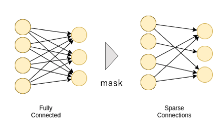

# CustomizedLinear

This is an extended torch.nn.Linear module that can customize the connection.



I use pytorch.

The module accept tensor named 'mask'.

Size of 'mask' is [n_input_feature, n_output_feature]
and the elements are {0, 1} which declares masked connection or not.

```
# example of mask
import torch
## mask which define a connection.
## The connection has 4-dim from-layer and 3-dim to-layer.
## And the connection is Sparse like as 'Sparse Connections' of the above chart.
mask = torch.tensor(
  [[1, 0, 1],
   [0, 1, 0],
   [1, 0, 1],
   [1, 0, 1],]
  )
```

（torchのnn.Linearを拡張して、結合の有無を指定できるようにしました。
結合の有無は引数'mask'で指定します。
'mask'はtensorで[入力ニューロン数,出力ニューロン数]の次元で、結合の有無を{0,1}で指定します。
）

# python version
Python 3.6.4


# Requirement

```
torch
numpy
```

# How to use this

please see 'how_to_use_this.py'.


``` python

#!/usr/bin/env python3
# -*- coding: utf-8 -*-
import torch
import numpy as np

from CustomizedLinear import CustomizedLinear

# mask matrix of INPUT-HIDDEN whose elements are 0 or 1.
mask = torch.tensor(
  [[1, 0, 1],
   [0, 1, 0],
   [1, 0, 1],
   [1, 0, 1],]
  )

# build customizedLinear as model
model = CustomizedLinear(mask, bias=None)

# So, dimmention of input is 4.  (mask.size()[0])
# dimmention of output is 3. (mask.size()[1])
Dim_INPUT = mask.size()[0]
Dim_OUTPUT = mask.size()[1]


# create randomly input x and output y
batch = 8
x = torch.randn(batch, Dim_INPUT)
y = torch.randn(batch, Dim_OUTPUT)


# backward pass
print('=== mask matrix ===')
print(mask)
print('===================')
learning_rate = 0.1
for t in range(3):
    # forward
    y_pred = model(x)

    # loss
    loss = (y_pred - y).abs().mean()

    # Zero the gradients before running the backward pass.
    model.zero_grad()

    # Use autograd to compute the backward pass
    loss.backward()

    # Update the weights
    with torch.no_grad():
        for param in model.parameters():
            param -= learning_rate * param.grad
            # check masked param.grad
            if np.array(param.grad).size == np.array(mask).size:
                print('--- epoch={}, loss={} ---'.format(t,loss.item()))
                print('↓↓↓masked weight↓↓↓')
                print(param.t())
                print('↓↓↓masked grad of weight↓↓↓')
                print(param.grad.t())


""" print result

  === mask matrix ===
  tensor([[1, 0, 1],
          [0, 1, 0],
          [1, 0, 1],
          [1, 0, 1]])
  ===================
  --- epoch=0, loss=0.8425361514091492 ---
  ↓↓↓masked weight↓↓↓
  tensor([[ 0.4512,  0.0000,  0.2171],
          [ 0.0000,  0.2417,  0.0000],
          [ 0.0757,  0.0000,  0.2107],
          [ 0.2108,  0.0000, -0.0492]], requires_grad=True)
  ↓↓↓masked grad of weight↓↓↓
  tensor([[ 0.0619,  0.0000,  0.0888],
          [-0.0000,  0.1645, -0.0000],
          [-0.0771, -0.0000,  0.0606],
          [ 0.0201, -0.0000, -0.1498]])
  --- epoch=1, loss=0.8354136943817139 ---
  ↓↓↓masked weight↓↓↓
  tensor([[ 0.4450,  0.0000,  0.2082],
          [ 0.0000,  0.2253,  0.0000],
          [ 0.0834,  0.0000,  0.2047],
          [ 0.2087,  0.0000, -0.0342]], requires_grad=True)
  ↓↓↓masked grad of weight↓↓↓
  tensor([[ 0.0619,  0.0000,  0.0888],
          [ 0.0000,  0.1645,  0.0000],
          [-0.0771,  0.0000,  0.0606],
          [ 0.0201,  0.0000, -0.1498]])
  --- epoch=2, loss=0.8282912373542786 ---
  ↓↓↓masked weight↓↓↓
  tensor([[ 0.4388,  0.0000,  0.1993],
          [ 0.0000,  0.2088,  0.0000],
          [ 0.0911,  0.0000,  0.1986],
          [ 0.2067,  0.0000, -0.0192]], requires_grad=True)
  ↓↓↓masked grad of weight↓↓↓
  tensor([[ 0.0619,  0.0000,  0.0888],
          [ 0.0000,  0.1645,  0.0000],
          [-0.0771,  0.0000,  0.0606],
          [ 0.0201,  0.0000, -0.1498]])
"""

```
